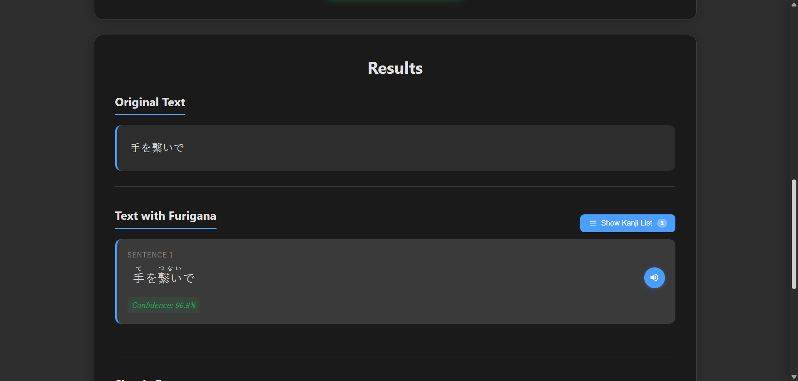

# Yomi 方 - Japanese Text Recognition & Learning Tool

A modern web application that extracts Japanese text from images using OCR, adds furigana annotations, and provides comprehensive kanji information to help with Japanese language learning.

## 🌟 Features

### Text Extraction
- **Image OCR**: Upload images containing Japanese text for automatic extraction using Azure Computer Vision
- **Direct Text Input**: Paste Japanese text directly for processing
- **Smart Text Orientation**: Automatically detects and handles both vertical and horizontal text layouts (includes heuristics for manga-style vertical text)

### Furigana Generation
- **Automatic Furigana**: Adds reading annotations (furigana) to kanji characters
- **Multiple Display Modes**: 
  - Traditional ruby text format (漢字 with furigana above)
  - Bracket format (漢字(かんじ))
- **Contextual Accuracy**: Uses MeCab and PyKakasi for more accurate readings and tokenization; falls back gracefully when tools are not installed
- HTML generator that outputs ruby-formatted furigana pages for quick preview/export

### Kanji Information System
- **Comprehensive Kanji Data**: Detailed information for each kanji including:
  - English meanings
  - On'yomi (音読み) and Kun'yomi (訓読み) readings
  - JLPT levels
  - Stroke counts
- **Smart Kanji Extraction**: Automatically identifies and lists all unique kanji from processed text
- **Multiple Sorting Options**:
  - Chronological order (as they appear)
  - JLPT level (easy to hard / hard to easy)
  - Stroke count (ascending / descending)
- **Kanji Collection**: Authenticated users can save kanji to a personal collection, view metadata, and remove entries in the Dashboard

### Audio Features
- **Text-to-Speech**: Listen to Japanese pronunciation using Azure Speech Services
- **Per-sentence Audio**: Play audio for individual sentences or text segments
- Audio returned as MP3 via API endpoint for easy playback in the frontend

### Translation
- **English Translation**: Automatic translation of Japanese text to English using Azure Translator

## ✅ New / Updated Features (since previous README)
- Full backend REST API (Flask) with endpoints for:
  - /api/upload — image upload + OCR + furigana + translation
  - /api/process-text — direct text processing (no OCR) producing furigana
  - /api/tts — generate TTS audio for given text
  - Authentication: /api/auth/register, /api/auth/login, /api/auth/profile, token verification, profile update
  - Kanji collection: /api/kanji/save, /api/kanji/saved, /api/kanji/remove
- User authentication with JWT and MongoDB (register/login/profile)
- User profile editor and Dashboard in frontend (save/remove kanji, sorting, details view)
- Improved OCR ordering logic to better handle vertical & horizontal text (sorting by bounding boxes)
- Dockerfile for containerized backend (includes MeCab system deps and convenience symlink for mecabrc)
- Better error handling and fallback when optional libs (MeCab / pykakasi) are missing
- Frontend improvements:
  - Dark/light theme support
  - Register & Login modals with validations
  - Profile editor, user dropdown, logout confirmation
  - Kanji selection, bulk save, notifications, and kanji info loading
- TTS SSML usage with Azure "Neural" voices and caching-ready response (audio returned as attachment)

## 📸 Screenshots





## 🛠️ Technology Stack

### Backend
- **Flask**: Python web framework
- **Azure Computer Vision**: OCR text extraction
- **Azure Speech Services**: Text-to-speech functionality
- **Azure Translator**: Text translation services
- **MeCab**: Japanese morphological analyzer (system package + mecab-python3)
- **PyKakasi**: Kana/romaji conversion & fallback readings
- **MongoDB**: User storage, kanji collections
- **flask-jwt-extended**: JWT authentication
- **bcrypt**: Password hashing

### Frontend
- **React**: Modern JavaScript framework (Create React App)
- **Axios / fetch**: HTTP client for API requests
- **CSS3**: Modern styling with dark/light theme support
- Responsive design with modals, dashboard and kanji UI components

### Deployment & Containerization
- Dockerfile provided for building a containerized backend image (installs mecab system deps and Python packages)
- Gunicorn used for production server process management

## 📋 API Reference (quick)
- GET /api/health — health check
- POST /api/upload — form-data file field `file` -> returns original text, furigana text, translation, pages/lines
- POST /api/process-text — JSON { text } -> returns furigana & translation
- POST /api/tts — JSON { text } -> returns audio (MP3)
- POST /api/auth/register — register { fullName, username, email, password }
- POST /api/auth/login — login { identifier, password } (identifier = email or username)
- GET /api/auth/profile — JWT protected, returns user profile
- POST /api/update-profile — JWT protected, update fullName & username
- PUT /api/auth/profile/progress — JWT protected, update study progress
- POST /api/kanji/save — JWT protected, save kanji list to user collection
- GET /api/kanji/saved — JWT protected, fetch user's kanji collection
- DELETE /api/kanji/remove — JWT protected, remove kanji from collection

(See source code files app.py and auth.py for full request/response shapes)

## 📋 Prerequisites
- Python 3.8+
- Node.js 14+
- Azure Cognitive Services account & keys (OCR, Translator, Speech)
- MongoDB Atlas or other MongoDB URI
- Environment variables (see .env example in repo)

## 🔧 Installation

### Backend Setup
1. Clone the repository:
```bash
git clone https://github.com/Karma121221/Yomi.git
cd Yomi
```

2. Install Python dependencies:
```bash
pip install -r requirements.txt
```

3. Set up environment variables in `.env` (example defaults present in repo — **do not** commit secrets):
```env
AZURE_OCR_ENDPOINT=...
AZURE_OCR_KEY=...
TTS_AZURE_ENDPOINT=...
TTS_AZURE_KEY=...
TL_AZURE_ENDPOINT=...
TL_AZURE_KEY=...
MONGODB_URI=...
JWT_SECRET_KEY=...
```

4. Run the Flask backend:
```bash
python app.py
```

Or in Docker:
```bash
docker build -t yomi-backend .
docker run -p 5000:80 --env-file .env yomi-backend
```

### Frontend Setup
1. Navigate to frontend directory:
```bash
cd frontend
```

2. Install dependencies:
```bash
npm install
```

3. For production deployment, set the backend API URL:
```bash
# Create .env file in frontend directory
echo "REACT_APP_API_URL=https://your-backend-url.onrender.com" > .env
```

4. Start the development server:
```bash
npm start
```

## 🚀 Production Deployment

### Vercel (Frontend) + Render (Backend) Setup

#### Backend (Render):
1. Connect your GitHub repository to Render
2. Set up environment variables in Render dashboard:
   - `AZURE_OCR_ENDPOINT`, `AZURE_OCR_KEY`
   - `TTS_AZURE_ENDPOINT`, `TTS_AZURE_KEY` 
   - `TL_AZURE_ENDPOINT`, `TL_AZURE_KEY`
   - `MONGODB_URI`, `JWT_SECRET_KEY`
3. Deploy using the included `Dockerfile`

#### Frontend (Vercel):
1. Connect your GitHub repository to Vercel
2. Set the Root Directory to `frontend`
3. **Important**: Set environment variable in Vercel:
   - `REACT_APP_API_URL=https://your-render-backend-url.onrender.com`
4. Deploy

#### Troubleshooting Long Loading Times:
If your site shows a loading spinner for an extended time on Vercel:
1. Ensure `REACT_APP_API_URL` is properly set in Vercel environment variables
2. Verify your Render backend URL is accessible
3. Check browser console for API connection errors
4. The app includes fallback timeouts to prevent indefinite loading

## 🔁 Usage
1. Upload an image or paste text into the frontend.
2. Review extracted text and furigana.
3. Play TTS audio for sentences or full text.
4. Save kanji to your collection (requires sign-up / sign-in).
5. Manage saved kanji in Dashboard; sort by JLPT, stroke count, etc.
6. Edit user profile, view study progress, and sign out.

## ⚠️ Notes & Troubleshooting
- MeCab: the Dockerfile installs system MeCab components. On macOS/Windows, install MeCab separately or use Docker to avoid platform-specific installation issues.
- Optional libraries: If PyKakasi or MeCab are not available, the app will fall back to simpler tokenization and still return results.
- Azure keys in `.env` are sensitive — rotate them and never push to a public repo.
- MongoDB URI in `.env` must point to a database with network access allowed from your environment.

## Contributing
Contributions welcome — please open PRs for bug fixes or new features. Follow repository code style and include tests where applicable.

## Acknowledgements
Uses KanjiAPI.dev, Azure Cognitive Services, MeCab, PyKakasi and other open source libraries. Thank you to contributors and the language learning community.
